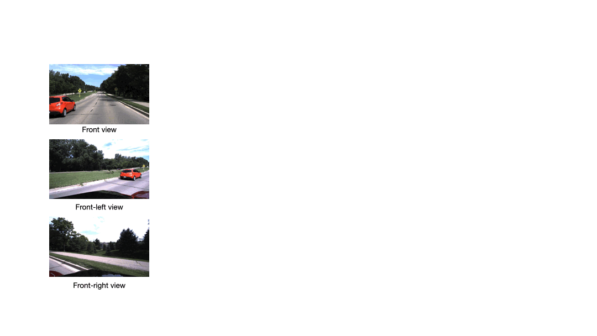

# Self-supervised surround-view depth estimation with volumetric feature fusion 
Jung-Hee Kim\*, Junwha Hur\*, Tien Nguyen, and Seong-Gyun Jeong - NeurIPS 2022 \
Link to the paper: [Link](https://openreview.net/forum?id=0PfIQs-ttQQ&referrer=%5BAuthor%20Console%5D(%2Fgroup%3Fid%3DNeurIPS.cc%2F2022%2FConference%2FAuthors%23your-submissions)) 
```
@inproceedings{kimself,
  title={Self-supervised surround-view depth estimation with volumetric feature fusion},
  author={Kim, Jung Hee and Hur, Junhwa and Nguyen, Tien Phuoc and Jeong, Seong-Gyun},
  booktitle={Advances in Neural Information Processing Systems (NeurIPS)}
  year = {2022},
}
```
## Introduction
We introduce a volumetric feature representation for self-supervised surround-view depth approach, which not only outputs metric-scale depth and canonical camera motion, but also synthesizes a depth map at a novel viewpoint. \
 
 <br>
 

## Installation
* Install required libraries using the  `requirements.txt` file. \
(Note that we leverage `packent-sfm`, `dgp` as submodules and therefore need to install required libraries related to the submodules.) 
* To install both required library and submodules, you need to follow instruction below:

```shell
git submodule init
git submodule update
pip install -r requirements.txt
```

## Datasets
### DDAD 
* DDAD dataset can be downloaded by running:

```shell
curl -s https://tri-ml-public.s3.amazonaws.com/github/DDAD/datasets/DDAD.tar 
```

* Place the dataset in `input_data/DDAD/`
* We manually created mask image for scene of ddad dataset and are provided in `dataset/ddad_mask`

### NuScenes 
* Download NuScenes official dataset
* Place the dataset in `input_data/nuscenes/`
* Scenes with backward and forward contexts are listed in `dataset/nuscenes/`
* Scenes with low visibility are filtered in `dataset/nuscenes/val.txt`

Data should be as follows:
```
├── input_data
│   ├── DDAD
│   │   ├── ddad_train_val
│   │   ├── ddad_test
│   ├── nuscenes
│   │   ├── maps
│   │   ├── samples
│   │   ├── sweeps
│   │   ├── v1.0-test
|   |   ├── v1.0-trainval
```
## Main Results

<table>
  <tr>
    <td>Model</td>
    <td>Scale</td>
    <td>Abs.Rel.</td>
    <td>Sq.Rel.</td>
    <td>RMSE</td>
    <td>RMSElog</td>
    <td>d<sub>1.25</sub></td>
    <td>d<sub>1.25</sub><sup>2</sup></td>
    <td>d<sub>1.25</sub><sup>3</sup></td>
  </tr>
  <tr>
    <td rowspan="2"><a href="https://drive.google.com/drive/folders/1UAPjm3pplVPkbS6jLsIFWDmsR8O8dX-1?usp=drive_link"> DDAD </a> </td>
    <td style="text-align:left">Metric</td>
    <td style="text-align:center">0.221</td>
    <td style="text-align:center">4.001</td>
    <td style="text-align:center">13.406</td>
    <td style="text-align:center">0.340</td>
    <td style="text-align:center">0.688</td>
    <td style="text-align:center">0.868</td>
    <td style="text-align:center">0.932</td>
  </tr>
  <tr>
    <td style="text-align:left">Median</td>
    <td style="text-align:center">0.221</td>
    <td style="text-align:center">3.884</td>
    <td style="text-align:center">13.225</td>
    <td style="text-align:center">0.328</td>
    <td style="text-align:center">0.692</td>
    <td style="text-align:center">0.877</td>
    <td style="text-align:center">0.939</td>
  </tr>
  <tr>
    <td rowspan="2"><a href="https://drive.google.com/drive/folders/1CipDGyLCYZcWKQSo1WlLbGsyn2ssL8dI?usp=drive_link"> NuScenes </a> </td>
    <td style="text-align:left">Metric</td>
    <td style="text-align:center">0.285</td>
    <td style="text-align:center">6.662</td>
    <td style="text-align:center">7.472</td>
    <td style="text-align:center">0.347</td>
    <td style="text-align:center">0.741</td>
    <td style="text-align:center">0.883</td>
    <td style="text-align:center">0.936</td>
  </tr>
  <tr>
    <td style="text-align:left">Median</td>
    <td style="text-align:center">0.258</td>
    <td style="text-align:center">4.282</td>
    <td style="text-align:center">7.226</td>
    <td style="text-align:center">0.329</td>
    <td style="text-align:center">0.735</td>
    <td style="text-align:center">0.883</td>
    <td style="text-align:center">0.937</td>
  </tr>  
</table>

## Get Started
### Training
Surround-view fusion depth estimation model can be trained from scratch.
* By default results are saved under `results/<config-name>` with trained model and tensorboard file for both training and validation.

**Single-GPU** <br>
Training the model using single-GPU: \
(Note that, due to usage of packnet-sfm submodule, userwarning repetitively occurs and therefore ignored while training.) 
```shell
python -W ignore train.py --config_file='./configs/ddad/ddad_surround_fusion.yaml'
python -W ignore train.py --config_file='./configs/nuscenes/nusc_surround_fusion.yaml'
```

**Multi-GPU** <br>
Training the model using Multi-GPU:
* Enable distributed data parallel(DDP), by setting ddp:ddp_enable to True in the config file
  * Gpus and the worldsize(number of gpus) must be specified (ex. gpus = [0, 1, 2, 3], worldsize= 4)
* DDP address and port setting can be configured in [ddp.py](utils/ddp.py)

```shell
python -W ignore train.py --config_file='./configs/ddad/ddad_surround_fusion_ddp.yaml' 
python -W ignore train.py --config_file='./configs/nuscenes/nusc_surround_fusion_ddp.yaml'
```

### Evaluation
To evaluate the trained model from scratch, run:
```shell
python -W ignore eval.py --config_file='./configs/<config-name>'
```
* The model weights need to be specified in `load: weights` of the config file. 

Evaluation results using the pretrained model can be obtained by using the following command:
```shell
python -W ignore eval.py --config_file='./configs/<config-name>' \
                         --weight_path='<pretrained-weight-path>'
```

### Depth Synthesis
To obtain synthesized depth results, train the model from scratch by running: 
```shell
python -W ignore train.py --config_file='./configs/ddad/ddad_surround_fusion_augdepth.yaml'
```

Then evaluate the model by running:
```shell
python -W ignore eval.py --config_file='./configs/ddad/ddad_surround_fusion_augdepth.yaml'
```

* The synthesized results are stored `results/<config-name>/syn_results`

## License
This repository is released under the [Apach 2.0](LICENSE) license.